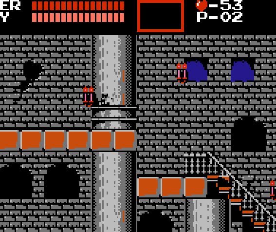

# Castlevania Improved Controls

This hack for Castlevania modernizes the control scheme to make it more
like Symphony of the Night and Mega Man, allowing the player more
control while in the air.

This branch of the repo introduces compatibility with
the ["Ultimate Castlevania" ROMHack](http://www.romhacking.net/hacks/3736/).

## Using or Contributing to This Repository

[Read instructions here.](./SETUP.md)

## Complete changelog

- Enables the player to control their x-velocity in mid-air while jumping (including while jump-attacking).
- When releasing the jump button, one immediately starts falling again; this allows the player to make smaller hops if desired.
- After being knocked back, the player regains control after a split second and can angle their fall.
- When walking off an edge, the player retains control instead of dropping straight down.
- The player can jump off of stairs at any point in the climb (however, it is still impossible to land on stairs, so be careful jumping from long flights of stairs over pits)